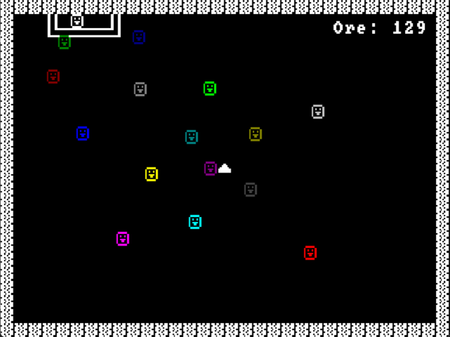
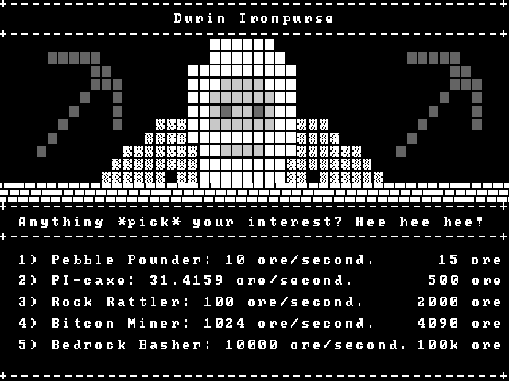

# OSRS (One Single Rock Server)

OSRS is a simple game written in C++ designed to implement a custom networking framework inspired by [OneLoneCoder](https://github.com/OneLoneCoder/Javidx9/tree/master/PixelGameEngine/BiggerProjects/Networking).

The framework utilizes a server-client topology and is developed using C++ with the asynchronous ASIO library, featuring custom messages, a thread-safe queue, client validation, and more. The game utilizes the SDL2 API to handle graphics, sound, and user input.

This project looks to test scalability techniques in networked video games and is part of one of my final year degree projects in university.

## Media

<div style="display:flex; justify-content:center;">
    
    
</div>

## Features

- **Server-Client Topology**: Implements a networked game architecture with a dedicated server and capability for multiple clients.
- **Custom Messages**: Supports custom message types to handle communication. Messages contain a header and a body. The payload of the body can be of any type thanks to the use of templates or enum classes.
- **Thread-Safe Queue**: Implements a thread-safe queue that uses locks to handle message communication.
- **Client Validation**: Data is encrypted with a scramble algorithm to validate clients with a handshake.
- **Performance**: Server includes a flag to maximize CPU usage (dedicated server) or maintain a balanced workload distribution.
- **SDL2 API**: Uses SDL2 for rendering graphics and handling user input.

## Gameplay

The idea of the game is straightforward. You play as a dwarf in an ore quarry with a single ore vein. It's an incremental game, where upgrading your pickaxes in the shop increases your mining speed. Compete with your friends to see who can accumulate more riches!

## Controls

- `WASD` to move around.
- `Space` to interact. Hold to mine ore, tap to open or close the shop.
- `Tab` to view scoreboard.
- `1 2 3 4 5` to buy new pickaxes in the shop.

## Requirements

- **C++**: 17 or later
- **SDL2**: [v2.30.3](https://github.com/libsdl-org/SDL/releases)
- **SDL2_image**: [v2.8.2](https://github.com/libsdl-org/SDL_image/releases)
- **SDL2_ttf**: [v2.22.0](https://github.com/libsdl-org/SDL_ttf/releases)
- **SDL2_mixer**: [v2.8.0](https://github.com/libsdl-org/SDL_mixer/releases)
- **ASIO**: [non-Boost](https://think-async.com/Asio/)

## Installation and Running

### Option 1: Pre-Packaged Zip (Includes Libraries)

1. Download the latest zip file from the [releases page](https://github.com/fluffles64/OSRS/releases).
2. Extract the zip file to your desired location.
3. Navigate to the location of the executables:
    `osrs > x64 > Debug`
4. Run the *server* and *client*. Make sure to update the `hostname` and `port` parameters in the *OnUserCreate()* method in *Client.cpp* to match the address where your server will be hosted. It defaults to the localhost address `127.0.0.1`. Additionally, the main function of the *Server.cpp* class allows you to modify the `port` the *server* will be listening on, which defaults to `60000`.

### Option 2: Build from Source

1. Clone the repository:
    ```bash
    git clone https://github.com/fluffles64/OSRS.git
    cd OSRS
    ```

2. Install the required dependencies:
    - Ensure you have C++17 or later installed.
    - Install SDL2, SDL2_image, SDL2_ttf, and SDL2_mixer from the links provided in the Requirements section, or install them directly using [vcpkg](https://vcpkg.link/ports/sdl2).
    - Download and install the non-Boost ASIO library from [here](https://think-async.com/Asio/).

3. Build the project:

   **If you are using Visual Studio**:
   
   - Add the SDL2, SDL2_image, SDL2_ttf, SDL2_mixer, and ASIO */include* folders into `Configuration Properties > VC++ Directories > Include Libraries`.
   - Similarly, add the SDL2, SDL2_image, SDL2_ttf, and SDL2_mixer *.lib* files into `Linker > Input > Additional Dependencies`.
   - Add the SDL2, SDL2_image, SDL2_ttf, and SDL2_mixer */lib/x64* folders into `Configuration Properties > VC++ Directories > Library Directories`.
   - Finally, make sure you copy and paste the SDL2, SDL2_image, SDL2_ttf, and SDL2_mixer *.dll* files into the same directory the client and the server executables are at.
   - The recommended setup is to create three different solutions: One for the *client*, one for the *server* and one for the *framework*. You can then add the *framework* project as a dependency when building the *client* and *server* projects in `Build Dependencies > Project Dependencies`.

    **If you are using CMake or vcpkg**:

   Create the appropriate *CMakeLists.txt* file and set up *environment variables* or a *CMakePresets.json* file. You can refer to examples and best practices in the following resources:
   [CMake](https://trenki2.github.io/blog/2017/06/02/using-sdl2-with-cmake/) and
   [vcpkg](https://github.com/njakob/vcpkg-sdl2-example).

    - Build the project:
        ```bash
        mkdir build
        cd build
        cmake ..
        make
        ```
        
    - Run the server and client:
        ```bash
        ./server
        ./client
        ```

## Contributing

1. **Fork the repository**.

2. **Create a new branch**:

    ```bash
    git checkout -b feature/YourFeature
    ```

3. **Commit your changes**:

    ```bash
    git commit -m 'Add some feature'
    ```

4. **Push to the branch**:

    ```bash
    git push origin feature/YourFeature
    ```

5. **Open a pull request**.

## License

This project is dual-licensed under the [MIT License](LICENSE.md) and the original [OLC-3 License](https://github.com/OneLoneCoder/Javidx9/blob/master/LICENCE.md) from OneLoneCoder, ensuring compliance with any external dependencies.
