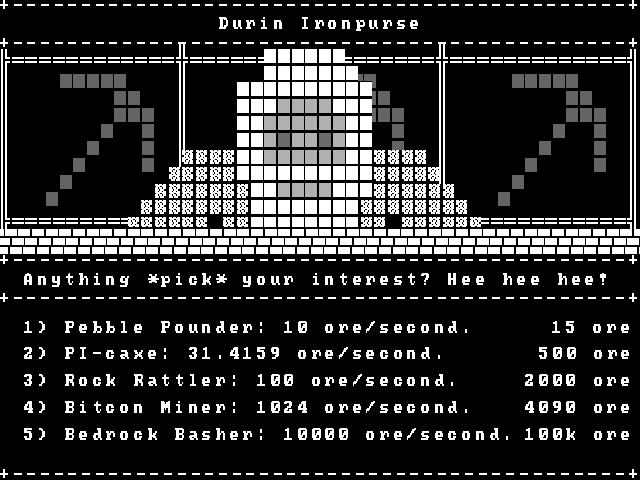

# OSRS (One Single Rock Server)

OSRS is a simple game written in C++ designed to implement a custom networking framework inspired by the one from [OneLoneCoder](https://github.com/OneLoneCoder/Javidx9/tree/master/PixelGameEngine/BiggerProjects/Networking). The framework utilizes a server-client topology and is developed using C++ with the ASIO library, featuring custom messages, a thread-safe queue, client validation, and more.

    
    

## Features

- **Server-Client Topology**: Implements a networked game architecture with a dedicated server and capability for multiple clients.
- **Custom Messages**: Supports custom message types for client-server communication.
- **Thread-Safe Queue**: Utilizes a thread-safe queue to handle message communication.
- **Client Validation**: Includes mechanisms for validating connected clients.
- **SDL2 API**: Uses SDL2 for rendering graphics and handling user input.

## Requirements

- **C++**: 17 or later
- **SDL2**: [v2.30.3](https://github.com/libsdl-org/SDL/releases)
- **SDL2_image**: [v2.8.2](https://github.com/libsdl-org/SDL_image/releases)
- **SDL2_ttf**: [v2.22.0](https://github.com/libsdl-org/SDL_ttf/releases)
- **SDL2_mixer**: [v2.8.0](https://github.com/libsdl-org/SDL_mixer/releases)
- **ASIO**: [non-Boost](https://think-async.com/Asio/)

## Controls

- `WASD` to move around.
- `Space` to interact. Hold to mine ore, tap to open or close the shop.
- `Tab` to view scoreboard.
- `1, 2, 3, 4, 5` to buy new pickaxes in the shop.
